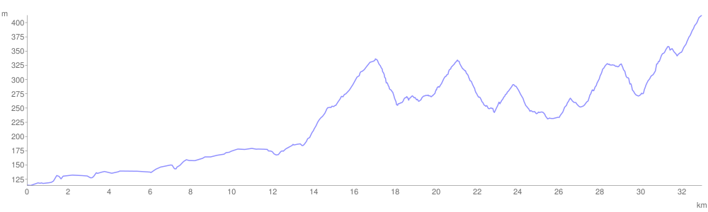

# Dan 1

## 5.7.93.

Na put smo krenuli kasno, oko 10h zato što me je boleo prst, a i deca su duže spavala. Vozili smo preko Dragocveta i Bunara, a kad samo skrenuli preko Cikota Nikola je odmarao svakih 5 min po 10 min.

U Rekovcu smo popili po piće u hotelu, odmorili se, a onda polako produžili dalje. Mrak nas je uhvatio iznad Motrića pa smo tu zanoćili u šumi. Po mraku su jelenci leteli kao leteći tenkovi, a deca su ih jurila i hvatala. Rano smo zaspali, a još ranije se probudili. U cik zore slavuji su pevali i probudili nas. Nastavili smo put posle doručka u šumi, stigli do Prevešta. Tu smo kod kume ponovo jeli, umili se i sredili, pa za Kalenić.

## Karta

<iframe width="100%" height="600px" frameborder="0" allowfullscreen src="//umap.openstreetmap.fr/en/map/dan-1_570086?scaleControl=false&miniMap=false&scrollWheelZoom=false&zoomControl=true&allowEdit=false&moreControl=false&searchControl=null&tilelayersControl=false&embedControl=false&datalayersControl=null&onLoadPanel=undefined&captionBar=false&fullscreenControl=true&datalayers=1625590&locateControl=false&measureControl=null&editinosmControl=false#11/43.9199/21.1806"></iframe>

## Visinski profil

