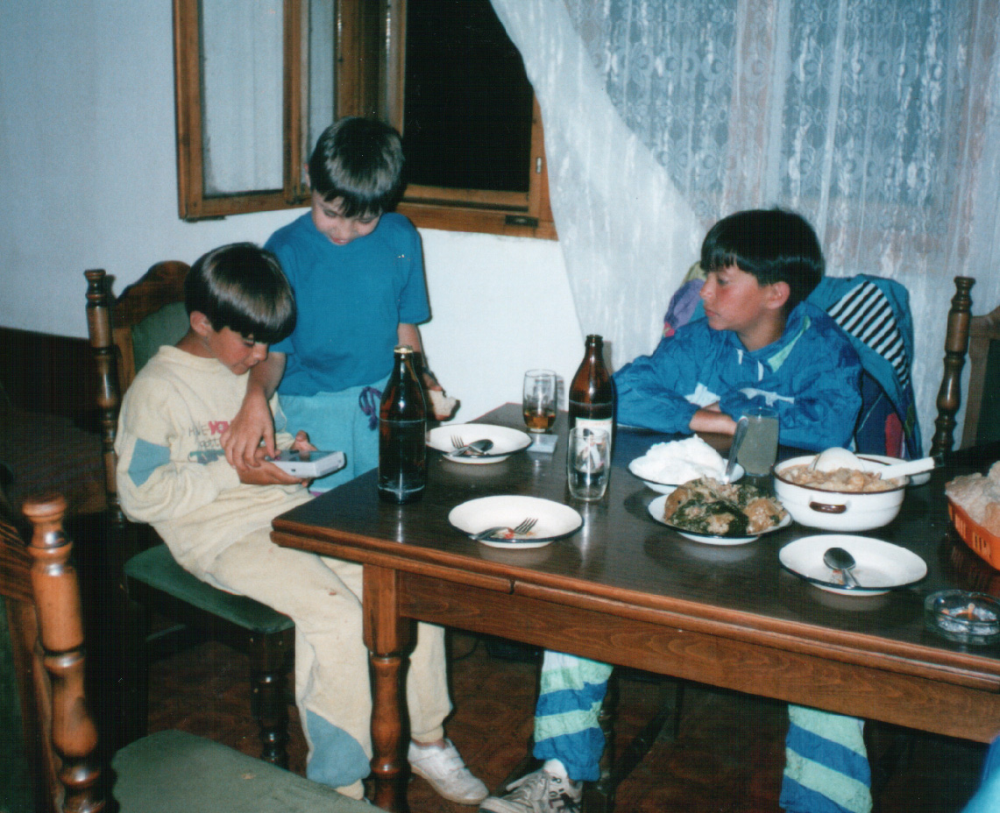

# Dan 7

## 11.7.

4 km uzbrdo do Karaule. Sprema se kiša ali traljavo. Kod Karaule smo pekli kobasice i odmorili se, a onda greškom sišli u selo Ploča. Trebali smo odmah levo.

|                 |           |
| --------------- | --------- |
| Km. od Jagodine | 130       |
| od Banje        | 37        |
| AVS             | 2.3 km/h  |

Iz greške u grešci!

Vozili smo divnim planinskim kosama putem prema Krivoj Reci i greškom (opet) promašili put. 2 km nizbrdo, pa nazad uzbrdo. Onda spuštanja, penjanja. Kupanje u Krivoj Reci. Klinci kažu najlepša reka. Po bespuću smo se peli do puta, onda "šlep sistem" sve dok me srčka nije izdala. Onda sam se na odmarao, a deca brala šumske jagode. Sve usvemu najnaporniji dan od početka puta. Došli smo do civilizacije tek pred veče.

**Km. 142,4**

U selu Kriva Reka kuća Petrović Bogdana i sina Radivoja. Sreli smo ga na putu i dobili gostoprimstvo. Razgovor ugodni uz pivo i kafu po pravom srpskom običaju gostoljublja. Zatim večera pa spavanje u krevetu kod domaćina.

<iframe width="100%" height="600px" frameborder="0" allowfullscreen src="//umap.openstreetmap.fr/en/map/bajsom-po-srbiji_570086?scaleControl=true&miniMap=false&scrollWheelZoom=false&zoomControl=true&allowEdit=false&moreControl=true&searchControl=false&tilelayersControl=null&embedControl=false&datalayersControl=null&onLoadPanel=undefined&captionBar=false&fullscreenControl=true&locateControl=false&editinosmControl=false&datalayers=1627582#13/43.4259/20.8867"></iframe>
