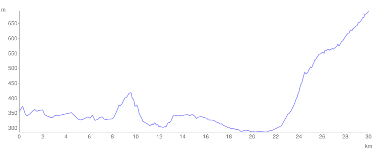

# Dan 18

## 22.7. Četvrtak

Došli smo do Bele Palanke i čekali pare na pošti. Malo smo gubili vreme po gradu, slikali se na vrelu i jeli teleću čorbu na piroćanski način (bez teletine). Oko 3 su stigle pare, ali u pošti nisu imali da isplate pa smo još malo bazali po gradu, onda ponovo do pošte. Tu smo podigli 50 mil., a 50 poslali dalje u Svrljig da me čekaju sutra. Uputili smo se zatim reko Svrljiške planine u Svrljig i negde na vrhu planine je počela kišica. Svratili smo u selo Gornja Glama, u prvu kuću sa senikom i tu se sklonili od kišice i napravili krevet u senu.

**Km. 558**

<iframe width="100%" height="600px" frameborder="0" allowfullscreen src="//umap.openstreetmap.fr/en/map/bajsom-po-srbiji_570086?scaleControl=true&miniMap=false&scrollWheelZoom=false&zoomControl=true&allowEdit=false&moreControl=true&searchControl=false&tilelayersControl=null&embedControl=false&datalayersControl=null&onLoadPanel=undefined&captionBar=false&fullscreenControl=true&locateControl=false&editinosmControl=false&datalayers=1627835#12/43.2469/22.4192"></iframe>

