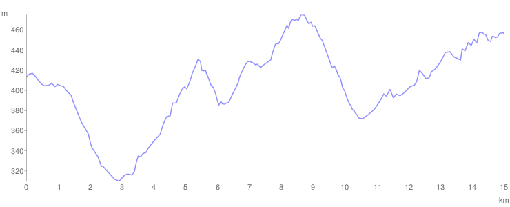

# Dan 2

## 6.7.

**50 km**

U cik zore slavuji su pevali i probudili nas. Nastavili smo put posle doručka u šumi, stigli do Prevešta. Tu smo kod kume ponovo jeli, umili se i sredili, pa za Kalenić.

U Kaleniću smo razapeli šator kod pozornice, obišli manastir i odmarali se do večeri. Vreme se kvari sprema se oluja.

Uveče je kišica počela da prska pa smo rano legli. Noću su konji toptali oko nas rzali i pasli, pa smo se budili ali noć je prošla izuzetno lepo.

<iframe width="100%" height="600px" frameborder="0" allowfullscreen src="//umap.openstreetmap.fr/en/map/bajsom-po-srbiji_570086?scaleControl=true&miniMap=false&scrollWheelZoom=false&zoomControl=true&allowEdit=false&moreControl=true&searchControl=false&tilelayersControl=null&embedControl=false&datalayersControl=null&onLoadPanel=undefined&captionBar=false&fullscreenControl=true&locateControl=false&editinosmControl=false&datalayers=1626664#13/43.7828/21.0342"></iframe>

