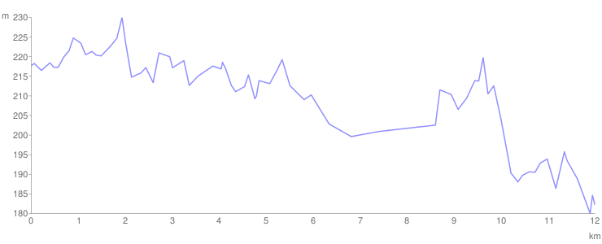

# Dan 20

## 24.7. Subota

Danas je dan za odmor i za pranje rublja.

Stali smo na desetak km od Knjaževca pored Belog Timoka pa sam ja oprao sve što je bilo prljavo, a deca su se igrala u Timoku. Nisam našao da kupim prašak za veš pa sam prao sredstvom za pranje tepiha. Boje će malo u aut, ali šta ću. Ložili smo vatru i pekli kobasice za ručak.

**I 57 km.**

**Donji M. 749 km**

<iframe width="100%" height="600px" frameborder="0" allowfullscreen src="//umap.openstreetmap.fr/en/map/bajsom-po-srbiji_570086?scaleControl=true&miniMap=false&scrollWheelZoom=false&zoomControl=true&allowEdit=false&moreControl=true&searchControl=false&tilelayersControl=null&embedControl=false&datalayersControl=null&onLoadPanel=undefined&captionBar=false&fullscreenControl=true&locateControl=false&editinosmControl=false&datalayers=1627837#12/43.6173/22.2565"></iframe>

