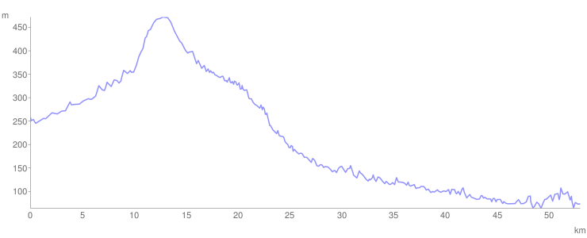

# Dan 22

## 26.7. Ponedeljak

Spavali smo licem okrenuti istoku da bi nas sunce probudilo. Krećemo da vozimo, ali za doručak — frka. Podelio sam poslednju lepinju deci ali Nikola je izvukao manji deo. "Ali Tata, ja sam gladan"! Suze samo teku. Marko se naravno odrekao većeg parčeta u korist plačka. On se najeo, pojeo je i pola čajne kobasice bez hleba. Ja jedem sir. Kasnije nam je vlajna iz Luke dala tri parčeta hleba, još kasnije sam kupio u seoskoj prodavnici ceo hleb (na ček, nemam ni dinara).

Dosta duga nizbrdica do Donjeg Milanovca. Našli smo Ljilju komšinicu, a Miki je bio u Majdanpeku. Domaćinski pasulj, salata, kupanje u Dunavu, večera, TV. Kao kod kuće. Spavamo, i tek ujutru se pojavljuje i Miki.

::: warning Napomena
Negde usput smo izgubili jedan dan. Po naraciji, u Ponedeljak 26. stižemo u Donji Milanovac i tu spavamo, zatim sledećeg dana putujemo do Golupca i tu spavamo. Međutim za datum kada se probudimo u Golupcu je stavljen Utorak 27., što se ne slaže sa naracijom tako da sam pomerio taj dan na Sredu 28. i sve naredne dane takođe za jedan dan u napred. — Marko
:::

<iframe width="100%" height="600px" frameborder="0" allowfullscreen src="//umap.openstreetmap.fr/en/map/bajsom-po-srbiji_570086?scaleControl=true&miniMap=false&scrollWheelZoom=false&zoomControl=true&allowEdit=false&moreControl=true&searchControl=false&tilelayersControl=null&embedControl=false&datalayersControl=null&onLoadPanel=undefined&captionBar=false&fullscreenControl=true&locateControl=false&editinosmControl=false&datalayers=1627839#10/44.2741/22.1788"></iframe>

