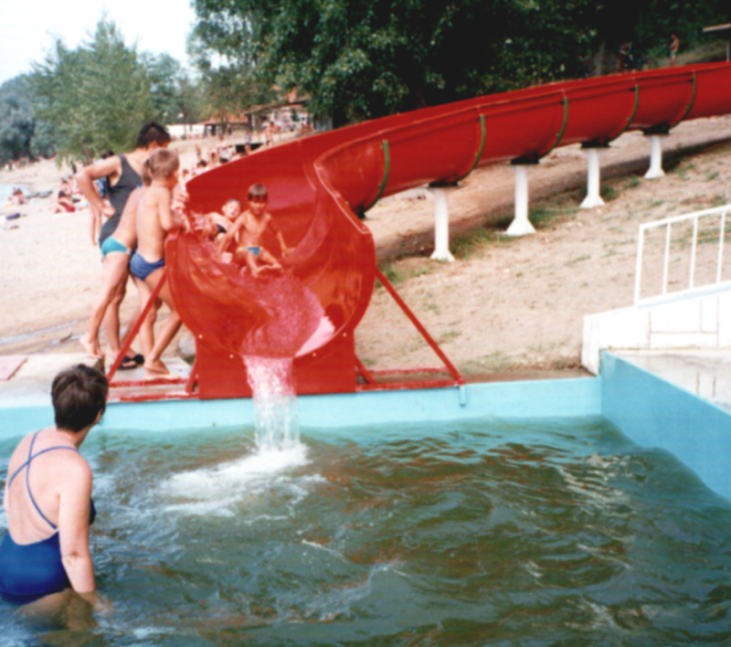
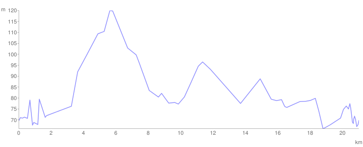

# Dan 24

## 28.7. Sreda

Krećemo prema Velikom gradištu, tamo pravimo pare, i smeštamo se na Srebrnom Jezeru. Trošimo pare nemilice na čamce, kanue, tobogane, sokove, palačinke itd. Naši poznanici sa broda su i ovde, pa se dogovaramo da sutra zajedno putujemo do Rama. Uveče nas komrci jedu nemilice.

<iframe width="100%" height="600px" frameborder="0" allowfullscreen src="//umap.openstreetmap.fr/en/map/bajsom-po-srbiji_570086?scaleControl=true&miniMap=false&scrollWheelZoom=false&zoomControl=true&allowEdit=false&moreControl=true&searchControl=false&tilelayersControl=null&embedControl=false&datalayersControl=null&onLoadPanel=undefined&captionBar=false&fullscreenControl=true&locateControl=false&editinosmControl=false&datalayers=1627841#12/44.7098/21.5506"></iframe>

