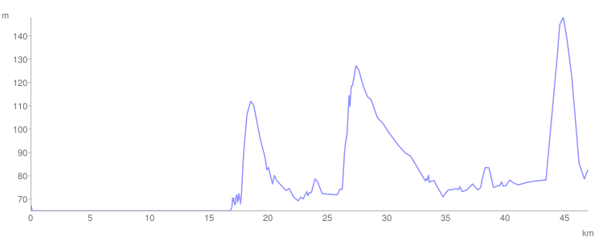

# Dan 25

## 29.7. Četvrtak

Ustajemo kasno, ukrcavamo se na brod i putujemo bez pedala. Uživanje. Domaćini, u početku vrlo nepoverljivi, malo su se raskravili tokom puta pa su ispričali o svojim neprijatnim iskustvima sa lopovima. Ja sam ih matirao time što sam im u startu dao kameru na čuvanje.

Od Rama krećemo prema Požarevcu. Dosadan put, ali nas u Požarevcu dočekuju u TV studiju kao pravi domaćini. Tu smo i spavali na podu u kancelariji.

<iframe width="100%" height="600px" frameborder="0" allowfullscreen src="//umap.openstreetmap.fr/en/map/bajsom-po-srbiji_570086?scaleControl=true&miniMap=false&scrollWheelZoom=false&zoomControl=true&allowEdit=false&moreControl=true&searchControl=false&tilelayersControl=null&embedControl=false&datalayersControl=null&onLoadPanel=undefined&captionBar=false&fullscreenControl=true&locateControl=false&editinosmControl=false&datalayers=1627842#11/44.7209/21.3366"></iframe>

