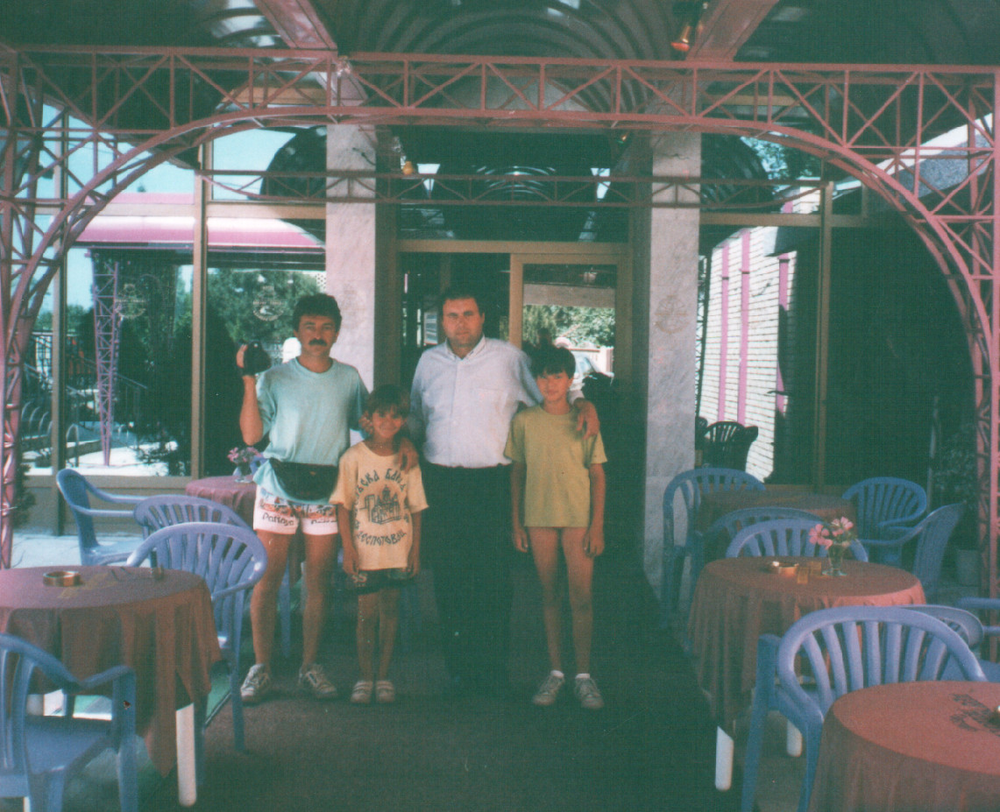
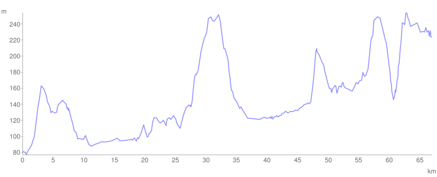

# Dan 26

## 30.7. Petak

Vučemo i guramo od Požarevca do Bobova. U hotelu u Bobovu se namećemo kao gosti.

Gostimo se do ujutru, pa onda za Jagodinu.

<iframe width="100%" height="600px" frameborder="0" allowfullscreen src="//umap.openstreetmap.fr/en/map/bajsom-po-srbiji_570086?scaleControl=true&miniMap=false&scrollWheelZoom=false&zoomControl=true&allowEdit=false&moreControl=true&searchControl=false&tilelayersControl=null&embedControl=false&datalayersControl=null&onLoadPanel=undefined&captionBar=false&fullscreenControl=true&locateControl=false&editinosmControl=false&datalayers=1627930#10/44.4317/21.3095"></iframe>

