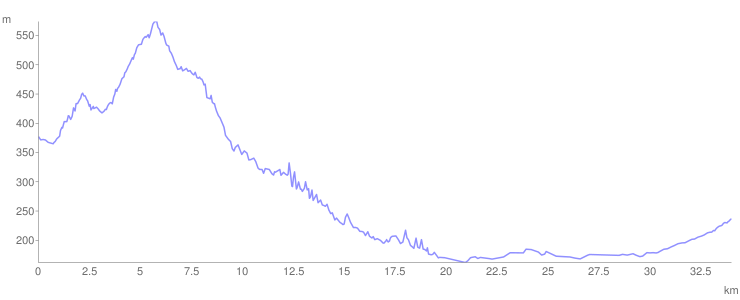

# Dan 4

## 8.7.

**56,4 Prevešt**

Posle doručka krenuli smo dalje. Preko Dubiča, uzbrdo 4 km. pa onda sve do Ljubostinje — nizbrdoooooo.

**73,2 km Ljubostinja**

U Trsteniku smo kupili pored puta prednju korpu za biciklu, usput smo popravili Markove bisage i stigli u Vrnj. Banju. Do sada smo prešli 90 km.

| Težina u V.Banji |    |
| ---------------- | -- |
| Ja               | 60 |
| Marko            | 36 |
| Nikola           | 25 |

Tu su nas lepo dečekale kolege iz Radio Vrnj. Banje, smestili nas u Hotel Brezu, pa smo prvu noć na putu proveli u krevetu. A tek tuširanje. Blate je sa nas teklo potocima.

<iframe width="100%" height="600px" frameborder="0" allowfullscreen src="//umap.openstreetmap.fr/en/map/bajsom-po-srbiji_570086?scaleControl=true&miniMap=false&scrollWheelZoom=false&zoomControl=true&allowEdit=false&moreControl=true&searchControl=false&tilelayersControl=null&embedControl=false&datalayersControl=null&onLoadPanel=undefined&captionBar=false&fullscreenControl=true&locateControl=false&editinosmControl=false&datalayers=1627126#12/43.6842/20.9685"></iframe>

