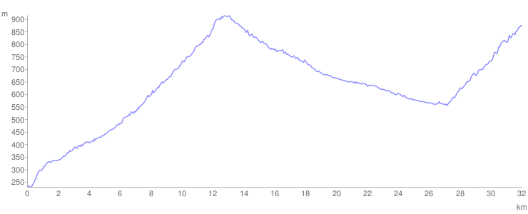

# Dan 6

## 10.7.

Rano u zoru 10.7. pakovanje za put pa uz Goč. 11 napornih km. uzbrdo, a onda voziii ... do Mitrovog Polja. Opet malo bazen, malo reka, malo kafana. Vlasnik (Đura) nikako da se odvoji od metalne pločice **JAGODINSKO PIVO**. Dobro bi mi došlo za registraciju pozadi na biciklu. Dalje nizbrdo do starog grada Koznik pa opet 8 km. uzbrdo kroz selo Koznicu. Prvi Markov kvar na biciklu — iskidao se lanac pa smo ga uz pomoć meštana (Goran) nastavili do pola brda, pa onda u selu spavali. Konak pod jabukom.

Očekivao sam da će biti hladno pa smo se dobro umotali, ali noć je bila divna. Gazda Mitar nam je ujutru doneo kafu i rakiju ali je on više popio, pa ga je ćerka Biserka jedva oterala da denu seno.

<iframe width="100%" height="600px" frameborder="0" allowfullscreen src="//umap.openstreetmap.fr/en/map/bajsom-po-srbiji_570086?scaleControl=true&miniMap=false&scrollWheelZoom=false&zoomControl=true&allowEdit=false&moreControl=true&searchControl=false&tilelayersControl=null&embedControl=false&datalayersControl=null&onLoadPanel=undefined&captionBar=false&fullscreenControl=true&locateControl=false&editinosmControl=false&datalayers=1627184#11/43.5317/20.9052"></iframe>

